## ✍ Requisitos iniciais
### Clonar o repositório
```bash
git clone https://github.com/caramelPopp/laravel-w-migration.git
```

### Conferir se o arquivo 'C:/xampp/php/php.ini' possui a linha 'extension=zip' descomentada 
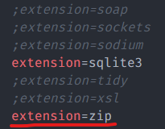

### Startar o Apache e o MySQL no XAMPP Control Panel
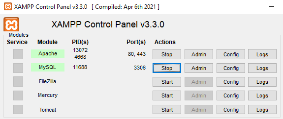

### Importe o banco de dados 'database/laravel-w-migration' para dentro do phpMyAdmin
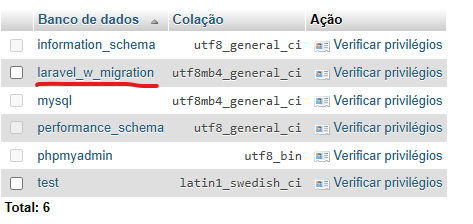

---

## 🚀 Como rodar o projeto
### 1. Instalar as dependências
```bash
composer install
```

### 2. Configurar o `.env`
```bash
cp .env.example .env  
php artisan key:generate
```

### 3. Rodar a aplicação
```bash
composer run dev
```

### 4. Acessar no navegador
```bash
http://127.0.0.1:8000
```

### 5. Criar um usuário ou usar o login padrão
*Cadastro*
<br>
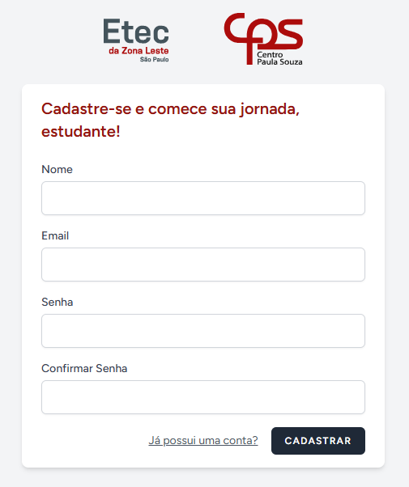
<br>

*Login padrão*
<br>
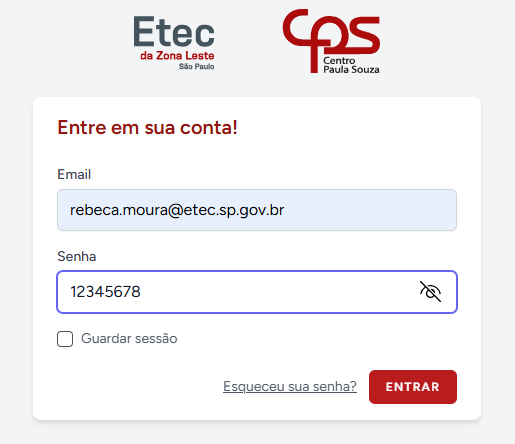
---

### 🎬 Instruções alternativas
Vídeo com o passo-a-passo para baixar e configurar um projeto com o Laravel + Breeze, além de um 'tour' pelo site criado a partir destas ferramentas:

https://youtu.be/fpnmeKkBWRI

---

## 🛠️ Funcionalidades implementadas

### Rota Fallback
Criação de uma rota fallback personalizada para exibir a mensagem de erro **Erro 404 ❌** em caso de páginas inexistentes ou não encontradas.  

*Criação da rota*
<br>
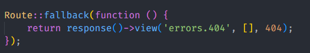

*Exibição da rota*
<br>
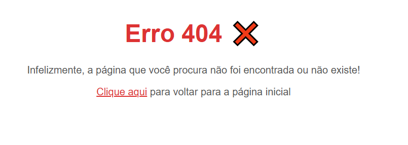


### Implementação do método GET ao formulário de contato
Formulário criado na página de contato, configurado para enviar dados pela URL.  

*Criação da rota do GET*
<br>


*Exibição do formulário*
<br>
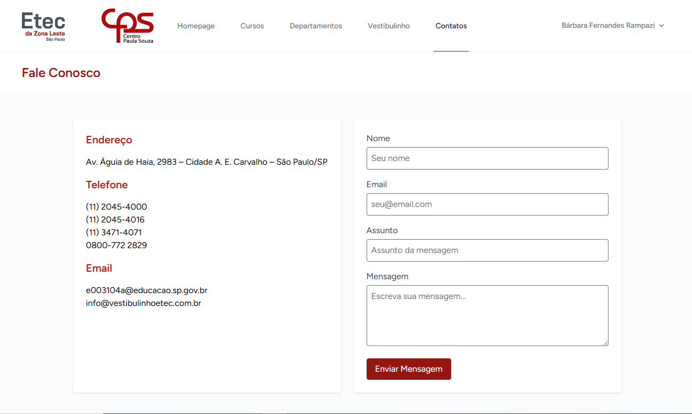

*Formulário com dados para testar o método GET*
<br>
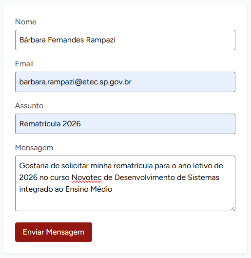

### Exibição com `var_dump($_GET)`
Controller configurado para exibir os parâmetros enviados pelo formulário de forma "crua", conforme exigência da tarefa.  

*Controller do formulário*
<br>
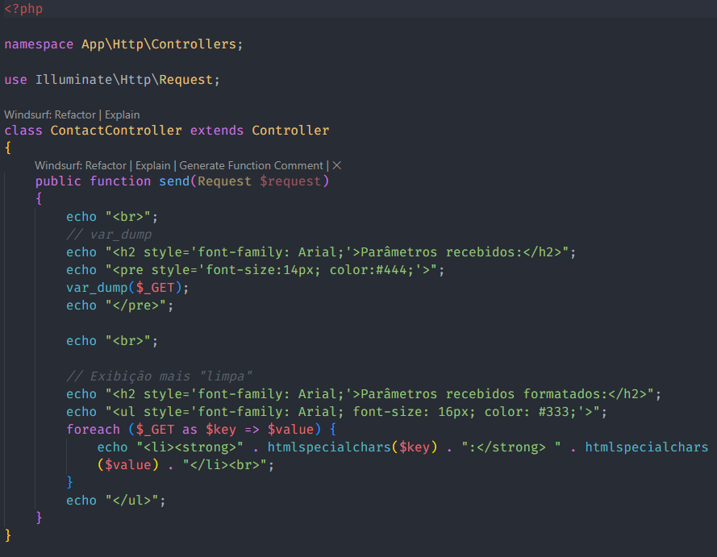

*Página com resultados do GET e var_dump*
<br>
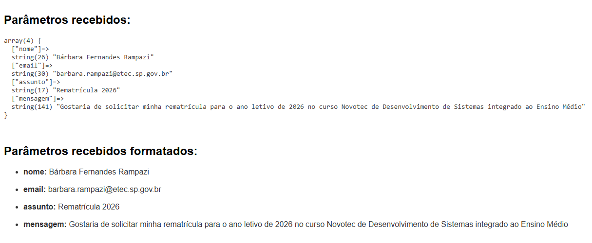
